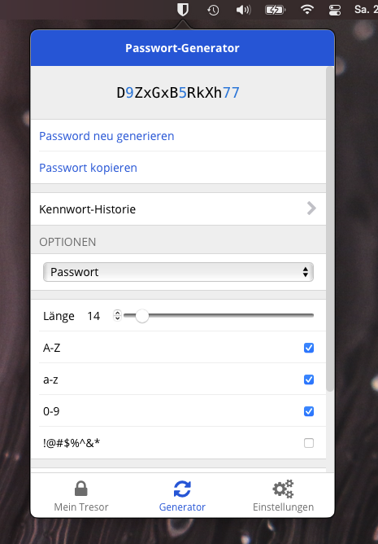

<h1 align="center">
  
  Bitwarden Menu
</h1>

**Bitwarden Menu** is a simple application for macOS that puts the
[Bitwarden Browser Extension](https://github.com/bitwarden/browser)
right into your menu bar.

  

## Installation
As I am not enrolled in the Apple Developer Program, I cannot sign this
Application. However, you may still download the `Bitwarden Menu.app`
from the [Releases](https://github.com/jnsdrtlf/bitwarden-menubar/releases).

Alternatively, you can build it yourself by cloning this project
using `git clone --recurse-submodules` and opening it in XCode.  
One part of the build process is to copy (a slightly modified version of)
the Bitwarden Browser Extension into the app. This is done using the
`Bitwarden/build.sh` script. You therefore have to make sure the
submodule (in `Bitwarden/browser`) is initialized and updated.

## License

The Bitwarden Browser Extension is licensed under the 
**GNU General Public License v3.0** and so is this project.

The App Icon is based on [this template](https://www.figma.com/community/file/857303226040719059/macOS-Big-Sur-Icon-Template)
by [**Vaclav Vancura**](http://vancura.design/) which is licensed under
**CC BY 4.0**.

## Trademark Notice

"Bitwarden" is a registered trademark of Bitwarden Inc.
